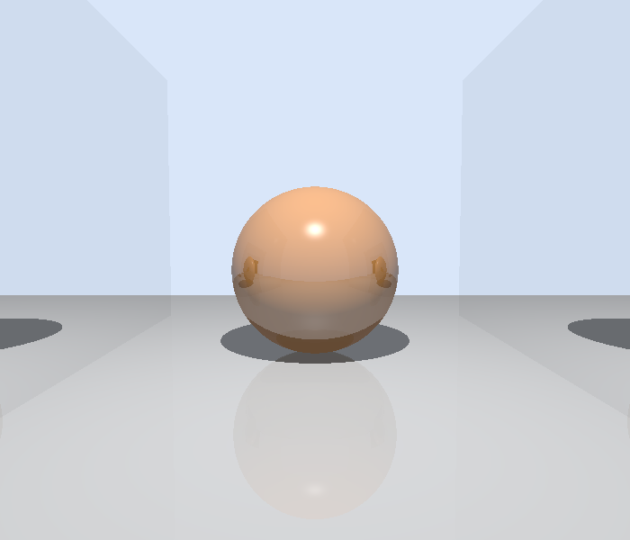

# C++ Ray Tracer

A CPU-based ray tracer written in C++23.

The renderer supports spheres and triangles, Phong shading, shadows, and recursive reflections. Performance is improved through a bounding volume hierarchy (BVH) for ray intersection queries and multithreaded rendering.

---

## Features

### Rendering

- Ray-sphere intersection for spatial geometry.
- Ray-triangle intersection using the Moeller-Trumbore algorithm.
- Phong shading with ambient, diffuse, and specular lighting.
- Shadows using shadow rays to detect light occlusion.
- Recursive reflections for reflective surfaces.

### Architecture & Performance

- Variant-based geometry using `std::visit` and `std::variant` to handle spheres and triangles without an inheritance hierarchy.
- Bounding Volume Hierarchy (BVH) for accelerating ray–object intersection queries.
- Multithreaded rendering using std::thread to distribute image rows across CPU threads.

### Scene I/O

- JSON scene configuration using `nlohmann::json`.
- PNG image exporting using `stb_image_write` to save rendered images.

---

## Gallery

### Pyramid
Triangle geometry, Phong shading, shadows, reflections.

### Mirrors
Recursive reflections between facing mirror surfaces

### Benchmark
100 spheres rendered at 1920x1080, used for performance measurements

---

## Performance

Two optimizations were implemented to improve rendering performance:

- **Bounding Volume Hierarchy (BVH):** Organizes scene geometry into a tree of axis-aligned bounding boxes, allowing ray intersection queries to skip objects that cannot be hit.
- **Multithreading:** Divides image rows among available CPU threads, allowing pixels to be rendered concurrently.

### Benchmark Results

Performance was measured using a 1920 × 1080 scene containing 100 spheres and two floor triangles. Each configuration was benchmarked five times using a GCC performance build, with the median wall-clock runtime reported below.

| Configuration | Median Runtime | Speedup |
|---|---:|---:|
| Original renderer | 2.75 s | 1.00× |
| With BVH | 1.72 s | 1.60× |
| BVH + multithreading | 0.49 s | **5.61×** |

The combined optimizations reduced total execution time by approximately **82%**.

Benchmarks measure end-to-end execution, including scene loading, rendering, and PNG export.

---

## Future Considerations

Potential improvements include:

- **Dynamic work distribution:** Replace static row partitioning with a work queue to better balance rendering workloads across threads.
- **Additional geometry:** Support more primitives or triangle meshes.
- **Sampling and anti-aliasing:** Improve image quality by tracing multiple rays per pixel.

